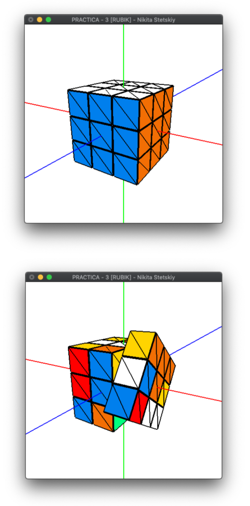

# Informática Gráfica

> Prácticas de la asignatura de IG 2020.

- Práctica 1: Modelado y Visualización de Objetos 3D Sencillos.

- Práctica 2: Modelos PLY y Poligonales.

- Práctica 3: Modelos Jerarquícos.

- Práctica 4: Materiales y Textura.

- Práctica 5: Cámara y Selección.

Pequeño aviso: la actividad se ha realizado en MacOs, habría que cambiar posiblemente las dependencias de cada archivo que inluya GLUT y makefile.

También hay que ejecutar la aplicación con el objeto ply para que no de error de segmentación.

  

