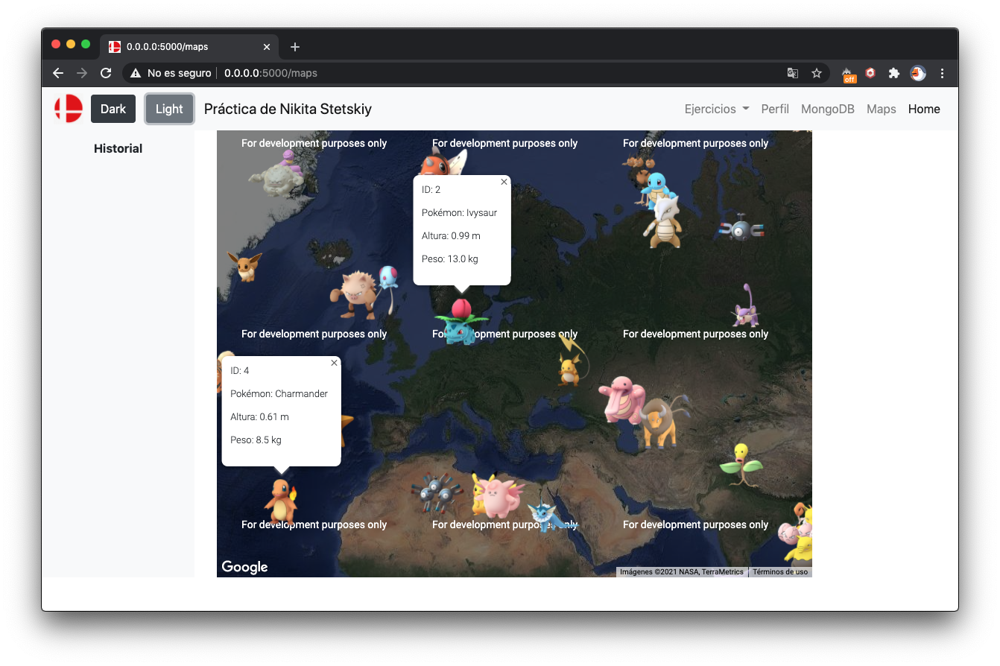

# Desarrollo de Aplicaciones para Internet

> Prácticas de la asignatura de DAI 2020

- Práctica 1: Python y entorno de trabajo con docker

- Práctica 2: Microframework Flask

- Práctica 3: Plantillas, Manejo de Sesiones y Frameworks CSS

- Práctica 4: Bases de Datos NoSQL, CRUD

- Práctica 5: API REST

- Práctica 6: Django

- Práctica 7: Autentificación

- Práctica 8: Front end con jQuery

- Práctica 9: Despliegue en producción

- Práctica 10: De libre elección

  

